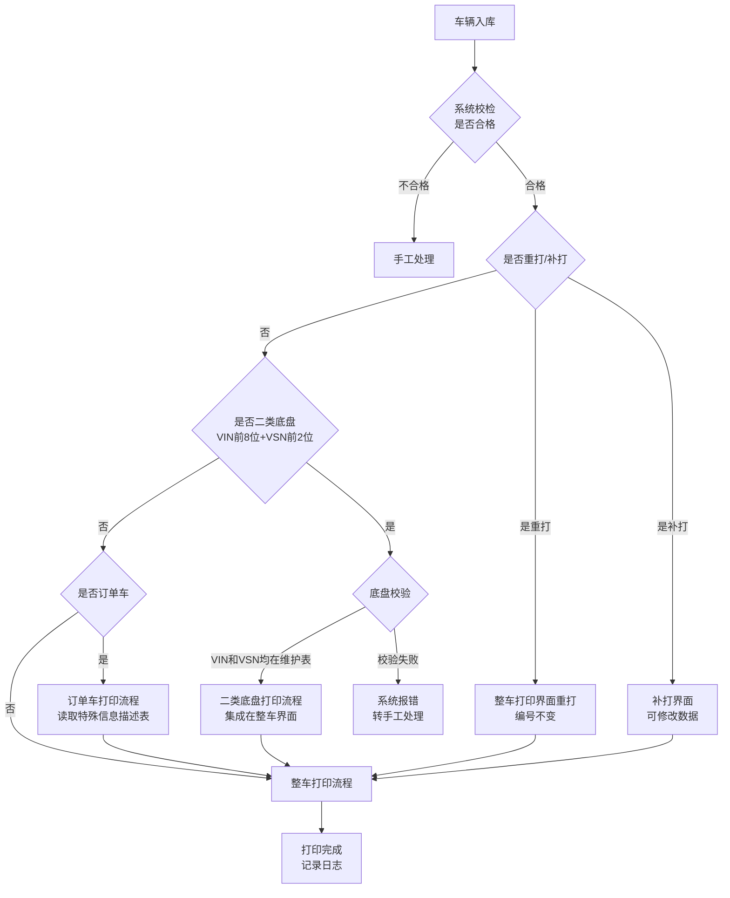
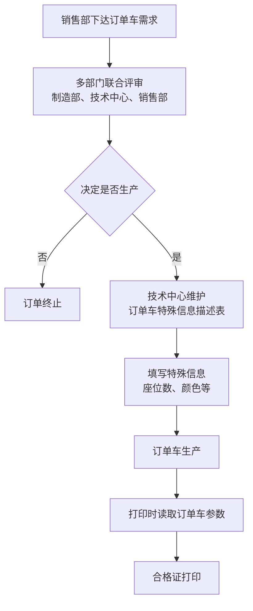
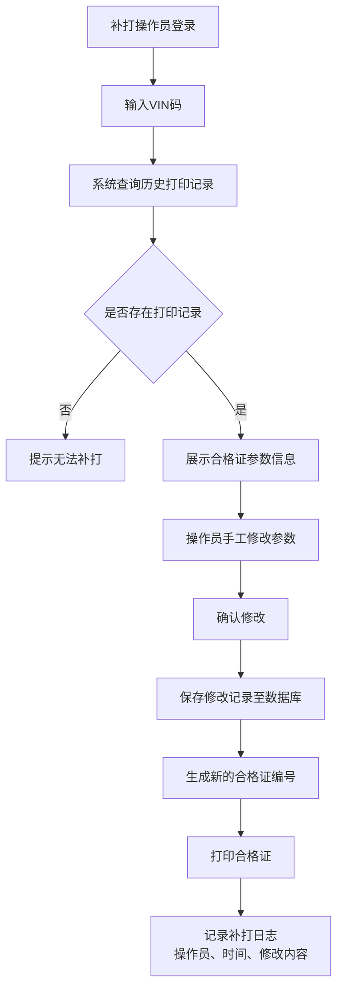
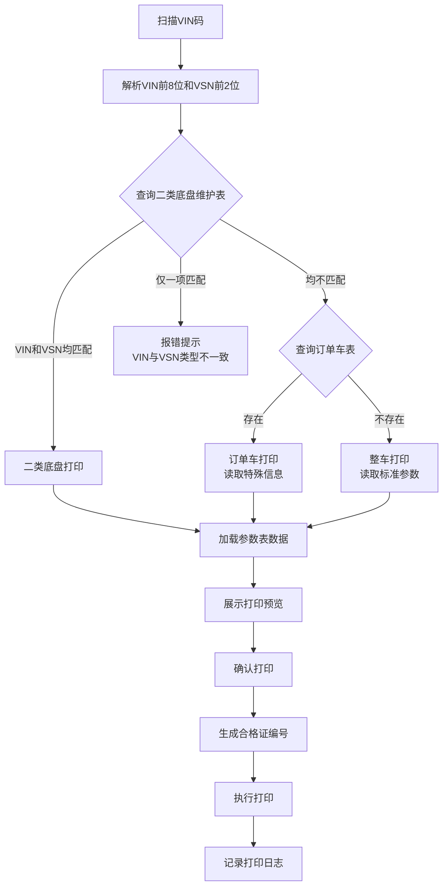
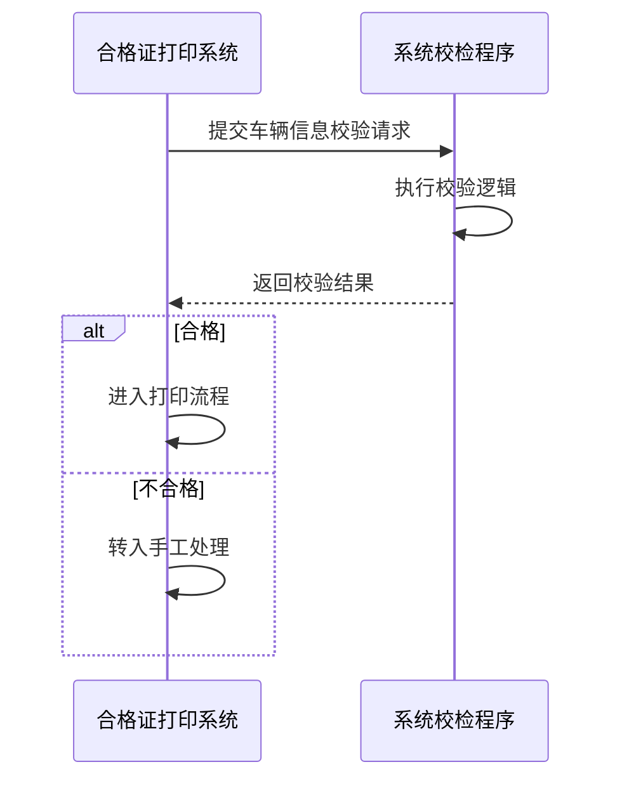
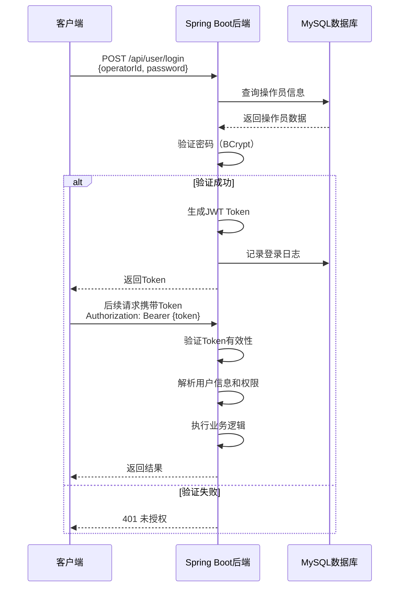

# 合格证打印系统设计文档

## 一、系统概述

### 1.1 系统背景

车辆合格证打印系统是车辆生产企业质量管理的重要组成部分。旧系统功能简单，缺乏流程管控、权限控制和统计报表功能。本系统旨在建立规范化、流程化的合格证打印管理体系。

### 1.2 系统目标

- 实现整车、二类底盘、订单车的分流打印管理
- 建立严格的权限控制机制
- 提供完善的参数维护和数据管理功能
- 实现全面的打印统计和历史追溯
- 确保合格证编号的唯一性和可追溯性

### 1.3 技术栈

#### 1.3.1 前端技术栈

- 前端框架：React 19.2.0
- 构建工具：Vite 7.2.4
- 开发语言：JavaScript (模块化)

#### 1.3.2 后端技术栈

- 开发语言：Java
- 应用框架：Spring Boot
- 数据库：MySQL
- 数据库管理工具：DataGrip

#### 1.3.3 架构模式

- 前后端分离架构
- RESTful API 接口通信
- 数据表之间通过中间表关联

## 二、业务术语定义

### 2.1 核心编码规则

| 编码类型   | 位数  | 组成说明                                                                 | 示例              |
| ---------- | ----- | ------------------------------------------------------------------------ | ----------------- |
| VIN 码     | 17 位 | 车辆识别码，包含生产厂家、年代、车型、车身型式、发动机代码及组装地点信息 | LZWABCJ1042033000 |
| VSN 码     | 13 位 | 前 4 位为车型代码，包含车型、发动机、档位、颜色、空调、批次号信息        | LE00HB562G001     |
| 合格证编号 | 14 位 | 前 4 位为生产企业代码，含企业代码、年份(4 位)、顺序号(6 位)              | -                 |

### 2.2 业务术语

| 术语     | 定义                                                                         |
| -------- | ---------------------------------------------------------------------------- |
| 重打     | 不修改数据的再次打印，用于掉电、卡纸等异常情况，合格证编号保持不变           |
| 补打     | 需要修改数据的打印，由专人在独立界面操作，可打印任何车型                     |
| 二类底盘 | 根据 VIN 前 8 位和 VSN 前 2 位判定，需在底盘维护表中同时存在才认定为二类底盘 |
| 订单车   | 经销售部下达需求、多部门联合决定生产的定制车辆                               |

## 三、系统角色与权限

### 3.1 角色定义

| 角色           | 职责范围         | 权限边界                                        |
| -------------- | ---------------- | ----------------------------------------------- |
| 参数表维护员   | 车型参数管理     | 参数表的增删改查、导出，车型信息维护            |
| 订单车维护员   | 订单车信息管理   | 订单车特殊信息描述表维护（技术中心负责）        |
| 打印操作员     | 正常打印执行     | 整车和二类底盘的正常打印、重打，需扫码 VIN 登录 |
| 补打操作员     | 补打执行         | 补打界面的查询、修改、打印，独立账号登录        |
| 二类底盘维护员 | 底盘识别规则管理 | VIN 前 8 位和 VSN 前 2 位的维护（质量部负责）   |
| 系统管理员     | 用户管理         | 操作员 ID 设置与管理                            |
| 报表查询员     | 数据统计查询     | 各类统计报表查询和导出                          |

### 3.2 权限控制策略

- 所有操作需登录验证，登录信息记入数据库
- 关键操作（参数维护、补打、底盘维护）需专人专岗
- 操作日志全程记录，包括操作人、操作时间、操作内容

## 四、业务流程设计

### 4.1 总体打印流程



### 4.2 二类底盘校验流程

#### 4.2.1 校验规则

根据 VIN 码前 8 位和 VSN 码前 2 位判定：

| VIN 前 8 位在维护表 | VSN 前 2 位在维护表 | 判定结果 | 处理方式                               |
| ------------------- | ------------------- | -------- | -------------------------------------- |
| 是                  | 是                  | 二类底盘 | 允许二类底盘打印                       |
| 否                  | 是                  | 数据异常 | 报错"VIN 是整车，VSN 是底盘，不可打印" |
| 是                  | 否                  | 数据异常 | 报错"VIN 是底盘，VSN 是整车，不可打印" |
| 否                  | 否                  | 整车     | 进入整车打印流程                       |

#### 4.2.2 打印控制矩阵

**二类底盘打印控制**

| VIN 为二类底盘 | VSN 为二类底盘 | 可否打印 |
| -------------- | -------------- | -------- |
| 是             | 是             | 可       |
| 否             | 是             | 否       |
| 是             | 否             | 否       |
| 否             | 否             | 否       |

**整车打印控制**

| VIN 为二类底盘 | VSN 为二类底盘 | 可否打印 |
| -------------- | -------------- | -------- |
| 是             | 是             | 否       |
| 否             | 是             | 否       |
| 是             | 否             | 否       |
| 否             | 否             | 可       |

### 4.3 订单车打印流程



### 4.4 补打流程



## 五、功能模块设计

### 5.1 参数表维护模块

#### 5.1.1 功能职责

- 按车型代码维护车辆参数基础数据
- 支持新车型快速配置
- 提供数据导出用于测试验证

#### 5.1.2 核心功能

| 功能     | 说明                                              |
| -------- | ------------------------------------------------- |
| 车型新增 | 支持参照已有车型复制参数，减少手工录入量          |
| 车型删除 | 删除指定车型代码及其关联参数                      |
| 参数修改 | 按车型代码修改对应的所有参数                      |
| 参数查询 | 根据车型代码查询参数表信息                        |
| 数据导出 | 将车型所有信息导出到 Excel 文档，供修改和打印测试 |

#### 5.1.3 参数表字段规范

| 字段名称     | 填写规范                                 | 示例                              |
| ------------ | ---------------------------------------- | --------------------------------- |
| 车辆品牌     | 中文必填需加"牌"字，中英文用"/"分隔      | 解放牌/FAW                        |
| 底盘型号     | 不允许填写汉字                           | CA1234PK2L5                       |
| 燃料种类     | 填写汉字                                 | 柴油                              |
| 排放标准     | 填写车辆符合的排放标准                   | 国六                              |
| 转向形式     | 填写汉字                                 | 方向盘                            |
| 轮距前后     | 数字，格式：前轮距/后轮距                | 1850/1800                         |
| 企业标准     | 格式：XXXX-XXXX《XXXXX》，过长自动转行   | Q/CR9999-2023《载货汽车技术条件》 |
| 底盘 ID      | 二类底盘必填，7 位数字                   | 1234567                           |
| 外廓尺寸     | 使用全角乘号"×"                          | 8500×2500×3200                    |
| 车辆类别     | 下拉选择：乘用车、货车、专用车、二类底盘 | 货车                              |
| 轴荷         | 满载轴荷，用"/"分隔，并装轴需注明        | 6500/17500 并装双轴               |
| 货箱内外尺寸 | 不填为空，填写不能有汉字                 | 4200×2300×2000                    |

#### 5.1.4 业务规则

- 每个车型代码对应唯一的参数集合
- 新增车型时必须填写完整的必填项
- 参数修改实时生效，影响后续打印
- 导出 Excel 功能仅用于测试，不作为数据导入源

### 5.2 订单车维护模块

#### 5.2.1 功能职责

- 维护订单车特殊信息描述表
- 记录订单车与标准车型的差异参数

#### 5.2.2 特殊信息管理

| 信息类型     | 说明                             |
| ------------ | -------------------------------- |
| 座位增减数量 | 相对标准配置的座位变化           |
| 订单车颜色   | 特殊定制颜色                     |
| 其他定制参数 | 根据订单需求维护的其他差异化信息 |

#### 5.2.3 填写规范

- 遵循与参数表相同的填写规范
- 特殊信息优先级高于标准参数表
- 由技术中心专人负责维护

#### 5.2.4 数据关系

- 订单车信息独立存储于订单车表
- 通过中间表关联订单车与基础车型参数
- 打印时优先读取订单车特殊信息，未定义字段使用标准参数
- 中间表维护订单车与参数表的多对一关系

### 5.3 合格证打印模块

#### 5.3.1 打印点配置

- 部署位置：车辆下线点
- 硬件要求：条码枪扫描 VIN
- 操作方式：操作员 ID 和密码登录

#### 5.3.2 打印类型

| 打印类型 | 触发场景         | 编号规则   | 权限要求           |
| -------- | ---------------- | ---------- | ------------------ |
| 正常打印 | 首次打印合格车辆 | 生成新编号 | 打印操作员         |
| 重打     | 掉电、卡纸等异常 | 编号不变   | 打印操作员         |
| 补打     | 需修改数据再打印 | 生成新编号 | 补打操作员（专人） |

#### 5.3.3 打印前校验



#### 5.3.4 重打控制

- 重打不改变原合格证编号
- 重打记录存入数据库，标注打印状态为"重打"
- 防止合格证编号被盗用

### 5.4 合格证补打模块

#### 5.4.1 补打场景

- 正常打印点无法打印的车辆
- 需要修改合格证参数的车辆
- 必须有正常打印历史记录才能补打

#### 5.4.2 补打流程控制

- 独立的补打界面
- 专人管理，独立账号密码
- 根据 VIN 码查询历史打印信息
- 支持参数修改
- 修改内容和操作日志记入数据库

#### 5.4.3 可补打车型

- 任何车型均可补打
- 需规范管理，避免滥用

### 5.5 二类底盘维护模块

#### 5.5.1 功能职责

- 维护二类底盘识别规则
- 管理 VIN 前 8 位和 VSN 前 2 位对照表

#### 5.5.2 维护内容

| 维护项          | 说明                                |
| --------------- | ----------------------------------- |
| VIN 前 8 位列表 | 所有二类底盘的 VIN 前缀             |
| VSN 前 2 位列表 | 所有二类底盘的 VSN 前缀             |
| 对应关系        | VIN 和 VSN 必须同时匹配才是二类底盘 |

#### 5.5.3 维护权限

- 质量部专人负责
- 增删改操作需记录日志

### 5.6 操作员管理模块

#### 5.6.1 功能职责

- 管理正常打印点操作员 ID
- 分配操作员账号和密码
- 维护操作员基本信息

#### 5.6.2 操作员信息

| 字段       | 说明                    |
| ---------- | ----------------------- |
| 操作员 ID  | 唯一标识                |
| 操作员姓名 | 真实姓名                |
| 密码       | 登录凭证                |
| 角色       | 打印操作员/补打操作员等 |
| 状态       | 启用/禁用               |

#### 5.6.3 管理权限

- 系统管理员专人负责
- 操作日志记录

## 六、查询统计模块设计

### 6.1 车辆打印历史查询

#### 6.1.1 查询条件

- 输入：VIN 码

#### 6.1.2 查询结果

| 字段       | 说明               |
| ---------- | ------------------ |
| VIN 号     | 车辆识别码         |
| 发动机号   | 发动机编号         |
| 打印状态   | 正常打印/重打/补打 |
| 打印时间   | 打印操作发生时间   |
| 操作员名称 | 执行打印的操作员   |
| 合格证编号 | 打印的合格证编号   |

#### 6.1.3 业务价值

- 追溯车辆合格证打印全历史
- 支持问题排查和质量追溯

### 6.2 订单车修改信息查询

#### 6.2.1 查询条件

- 输入：时间段（起始时间、结束时间）

#### 6.2.2 查询结果

| 字段         | 说明               |
| ------------ | ------------------ |
| 修改时间     | 订单车信息修改时间 |
| 生产年份     | 车辆生产年份       |
| VSN          | 车辆识别码         |
| 品种代码     | 车型品种代码       |
| 轮胎数       | 车辆轮胎数量       |
| 轮胎规格     | 轮胎规格型号       |
| 钢板弹簧片数 | 钢板弹簧数量       |
| 载客人数     | 核定载客人数       |
| 总质量       | 车辆总质量         |
| 整备质量     | 车辆整备质量       |

#### 6.2.3 业务价值

- 监控订单车参数变更情况
- 支持订单车管理审计

### 6.3 合格证数量统计

#### 6.3.1 查询条件

- 输入：时间段（起始时间、结束时间）

#### 6.3.2 查询结果

| 字段     | 说明         |
| -------- | ------------ |
| 打印时间 | 车辆打印时间 |
| 合格证号 | 合格证编号   |
| 品种代码 | 车型品种代码 |
| VIN      | 车辆识别码   |

#### 6.3.3 统计规则

- 按不同 VIN 号统计车辆总数
- 同一 VIN 的重打或补打只计入一次
- 统计的是车辆数量，非打印纸张数量

#### 6.3.4 输出

- 统计汇总：合格证总数量
- 明细列表：按上表展示

### 6.4 操作员合格证打印数量查询

#### 6.4.1 查询条件

- 输入：操作员、时间段

#### 6.4.2 查询结果

| 字段       | 说明               |
| ---------- | ------------------ |
| 操作员姓名 | 操作员姓名         |
| 打印时间   | 操作时间           |
| 合格证号   | 合格证编号         |
| 品种代码   | 车型品种代码       |
| VIN        | 车辆识别码         |
| 打印状态   | 正常打印/重打/补打 |

#### 6.4.3 统计规则

- 统计某操作员在时间段内打印的合格证纸张总数
- 包括正常打印、重打、补打的所有纸张
- 同一 VIN 的多次打印分别计数

#### 6.4.4 输出

- 统计汇总：该操作员合格证打印总张数
- 明细列表：按上表展示

### 6.5 操作员补打数量查询

#### 6.5.1 查询条件

- 输入：操作员、时间段

#### 6.5.2 查询结果

| 字段       | 说明         |
| ---------- | ------------ |
| 操作员姓名 | 操作员姓名   |
| 打印时间   | 补打时间     |
| 合格证号   | 合格证编号   |
| 品种代码   | 车型品种代码 |
| VIN        | 车辆识别码   |
| 打印状态   | 补打         |

#### 6.5.3 统计规则

- 仅统计补打的合格证数量
- 补打是指在正常打印点无法打印，必须到办公室打印的情况

#### 6.5.4 输出

- 统计汇总：该操作员补打合格证总张数
- 明细列表：按上表展示

### 6.6 合格证编号查询

#### 6.6.1 查询条件

- 输入：合格证编号

#### 6.6.2 查询结果

- 展示该合格证的完整信息
- 包括车辆参数、打印时间、操作员等所有关联数据

#### 6.6.3 业务价值

- 通过合格证编号反查车辆信息
- 支持合格证真伪验证

## 七、数据模型设计

### 7.1 核心数据实体

#### 7.1.1 参数表实体

| 实体属性     | 数据类型     | 必填     | 说明                          |
| ------------ | ------------ | -------- | ----------------------------- |
| 车型代码     | 字符串(4 位) | 是       | 主键，VSN 前 4 位             |
| 车辆品牌中文 | 字符串       | 是       | 需加"牌"字                    |
| 车辆品牌英文 | 字符串       | 否       | -                             |
| 底盘型号     | 字符串       | 是       | 不含汉字                      |
| 燃料种类     | 字符串       | 是       | 汉字                          |
| 排放标准     | 字符串       | 是       | -                             |
| 转向形式     | 字符串       | 是       | 汉字                          |
| 轮距前       | 数字         | 是       | 单位：mm                      |
| 轮距后       | 数字         | 是       | 单位：mm                      |
| 企业标准     | 字符串       | 是       | 格式：XXXX-XXXX《XXXXX》      |
| 底盘 ID      | 字符串(7 位) | 条件必填 | 二类底盘必填                  |
| 外廓长       | 数字         | 是       | 单位：mm                      |
| 外廓宽       | 数字         | 是       | 单位：mm                      |
| 外廓高       | 数字         | 是       | 单位：mm                      |
| 车辆类别     | 枚举         | 是       | 乘用车/货车/专用车/二类底盘   |
| 轴荷信息     | 字符串       | 是       | 格式：轴荷 1/轴荷 2[并装说明] |
| 货箱内长     | 数字         | 否       | 单位：mm                      |
| 货箱内宽     | 数字         | 否       | 单位：mm                      |
| 货箱内高     | 数字         | 否       | 单位：mm                      |
| 创建时间     | 时间戳       | 是       | 自动生成                      |
| 修改时间     | 时间戳       | 是       | 自动更新                      |
| 维护人       | 字符串       | 是       | 维护员 ID                     |

#### 7.1.2 订单车信息实体

| 实体属性     | 数据类型  | 必填 | 说明                        |
| ------------ | --------- | ---- | --------------------------- |
| 订单编号     | 字符串    | 是   | 主键                        |
| 基础车型代码 | 字符串    | 是   | 关联参数表                  |
| 座位数变化   | 整数      | 否   | 正数为增加，负数为减少      |
| 订单颜色     | 字符串    | 否   | 特殊颜色                    |
| 特殊参数     | JSON 对象 | 否   | 其他差异化参数              |
| 订单状态     | 枚举      | 是   | 待审核/已批准/生产中/已完成 |
| 创建时间     | 时间戳    | 是   | 销售部下达时间              |
| 审批时间     | 时间戳    | 否   | 联合评审通过时间            |
| 维护人       | 字符串    | 是   | 技术中心维护员 ID           |

#### 7.1.3 订单车参数关联表实体（中间表）

| 实体属性 | 数据类型 | 必填 | 说明                   |
| -------- | -------- | ---- | ---------------------- |
| 关联 ID  | 自增整数 | 是   | 主键                   |
| 订单编号 | 字符串   | 是   | 外键，关联订单车信息表 |
| 车型代码 | 字符串   | 是   | 外键，关联参数表       |
| 创建时间 | 时间戳   | 是   | -                      |
| 维护人   | 字符串   | 是   | 技术中心维护员 ID      |

#### 7.1.4 二类底盘维护实体

| 实体属性    | 数据类型     | 必填 | 说明            |
| ----------- | ------------ | ---- | --------------- |
| 记录 ID     | 自增整数     | 是   | 主键            |
| VIN 前 8 位 | 字符串(8 位) | 是   | -               |
| VSN 前 2 位 | 字符串(2 位) | 是   | -               |
| 底盘说明    | 字符串       | 否   | 备注信息        |
| 维护时间    | 时间戳       | 是   | -               |
| 维护人      | 字符串       | 是   | 质量部维护员 ID |

#### 7.1.5 打印日志实体

| 实体属性     | 数据类型      | 必填 | 说明                 |
| ------------ | ------------- | ---- | -------------------- |
| 日志 ID      | 自增整数      | 是   | 主键                 |
| VIN          | 字符串(17 位) | 是   | 车辆识别码           |
| VSN          | 字符串(13 位) | 是   | -                    |
| 发动机号     | 字符串        | 是   | -                    |
| 合格证编号   | 字符串(14 位) | 是   | -                    |
| 车型代码     | 字符串        | 是   | 品种代码             |
| 打印类型     | 枚举          | 是   | 正常打印/重打/补打   |
| 车辆类型     | 枚举          | 是   | 整车/二类底盘/订单车 |
| 打印时间     | 时间戳        | 是   | -                    |
| 操作员 ID    | 字符串        | 是   | -                    |
| 操作员姓名   | 字符串        | 是   | 冗余存储             |
| 打印参数快照 | JSON 对象     | 是   | 完整参数备份         |
| 是否成功     | 布尔          | 是   | 打印结果             |

#### 7.1.6 补打修改记录实体

| 实体属性    | 数据类型 | 必填 | 说明          |
| ----------- | -------- | ---- | ------------- |
| 记录 ID     | 自增整数 | 是   | 主键          |
| 打印日志 ID | 整数     | 是   | 关联打印日志  |
| VIN         | 字符串   | 是   | -             |
| 修改字段    | 字符串   | 是   | 字段名称      |
| 修改前值    | 字符串   | 是   | -             |
| 修改后值    | 字符串   | 是   | -             |
| 修改时间    | 时间戳   | 是   | -             |
| 修改人      | 字符串   | 是   | 补打操作员 ID |
| 修改原因    | 字符串   | 否   | 补打原因说明  |

#### 7.1.7 操作员实体

| 实体属性     | 数据类型 | 必填 | 说明                               |
| ------------ | -------- | ---- | ---------------------------------- |
| 操作员 ID    | 字符串   | 是   | 主键                               |
| 姓名         | 字符串   | 是   | -                                  |
| 密码         | 字符串   | 是   | 加密存储                           |
| 角色         | 枚举     | 是   | 参数维护员/打印操作员/补打操作员等 |
| 部门         | 字符串   | 否   | -                                  |
| 状态         | 枚举     | 是   | 启用/禁用                          |
| 创建时间     | 时间戳   | 是   | -                                  |
| 最后登录时间 | 时间戳   | 否   | -                                  |

#### 7.1.8 登录日志实体

| 实体属性  | 数据类型 | 必填 | 说明              |
| --------- | -------- | ---- | ----------------- |
| 日志 ID   | 自增整数 | 是   | 主键              |
| 操作员 ID | 字符串   | 是   | -                 |
| 登录时间  | 时间戳   | 是   | -                 |
| 登录方式  | 枚举     | 是   | 账号密码/扫码 VIN |
| 登录 IP   | 字符串   | 否   | -                 |
| 是否成功  | 布尔     | 是   | -                 |

### 7.2 数据关系说明

#### 7.2.1 核心关系

- 参数表 ← 订单车参数关联表 → 订单车信息（通过中间表关联）
- 打印日志 → 参数表（通过车型代码关联）
- 打印日志 → 订单车信息（通过订单编号关联，可选）
- 打印日志 → 操作员（通过操作员 ID 关联）
- 补打修改记录 → 打印日志（多对一）
- 登录日志 → 操作员（多对一）

#### 7.2.2 数据一致性要求

- 打印日志保存完整参数快照，避免参数表修改影响历史数据
- 合格证编号全局唯一，不可重复
- VIN 码在打印日志中唯一（不考虑重打和补打）

#### 7.2.3 中间表设计

通过中间表实现订单车与参数表的松耦合关联，支持一个订单车引用一个基础车型，同时保持数据独立性。

### 7.3 MySQL 表结构设计说明

#### 7.3.1 核心表结构设计原则

| 原则     | 说明                                                  |
| -------- | ----------------------------------------------------- |
| 命名规范 | 表名统一使用 tb\_ 前缀，字段名使用下划线分隔          |
| 主键设计 | 所有表必须有自增主键 id (BIGINT AUTO_INCREMENT)       |
| 时间字段 | 使用 DATETIME 类型，命名为 created_time, updated_time |
| 逻辑删除 | 添加 deleted 字段 (TINYINT)，0-未删除，1-已删除       |
| 乐观锁   | 添加 version 字段 (INT)，用于并发控制                 |
| 字符集   | 统一使用 utf8mb4 字符集                               |
| 注释     | 所有表和字段必须添加中文注释                          |

#### 7.3.2 外键关系设计

| 关系              | 主表                 | 从表                   | 外键字段     | 约束策略           |
| ----------------- | -------------------- | ---------------------- | ------------ | ------------------ |
| 订单车-参数表     | tb_vehicle_parameter | tb_order_parameter_rel | model_code   | 级联更新，禁止删除 |
| 订单车-关联表     | tb_order_vehicle     | tb_order_parameter_rel | order_no     | 级联删除           |
| 打印日志-操作员   | tb_operator          | tb_print_log           | operator_id  | 级联更新，禁止删除 |
| 补打记录-打印日志 | tb_print_log         | tb_reprint_modify_log  | print_log_id | 级联删除           |
| 登录日志-操作员   | tb_operator          | tb_login_log           | operator_id  | 级联更新，禁止删除 |

#### 7.3.3 索引设计详细说明

**tb_vehicle_parameter 参数表**

- PRIMARY KEY: id
- UNIQUE KEY: uk_model_code (model_code) - 车型代码唯一
- INDEX: idx_vehicle_category (vehicle_category) - 车辆类别查询
- INDEX: idx_deleted (deleted) - 逻辑删除查询

**tb_order_vehicle 订单车信息表**

- PRIMARY KEY: id
- UNIQUE KEY: uk_order_no (order_no) - 订单编号唯一
- INDEX: idx_order_status (order_status) - 订单状态查询
- INDEX: idx_created_time (created_time) - 创建时间范围查询

**tb_order_parameter_rel 订单车参数关联表**

- PRIMARY KEY: id
- UNIQUE KEY: uk_order_model (order_no, model_code) - 订单与车型组合唯一
- INDEX: idx_order_no (order_no) - 订单号查询
- INDEX: idx_model_code (model_code) - 车型代码查询

**tb_chassis_config 二类底盘维护表**

- PRIMARY KEY: id
- UNIQUE KEY: uk_vin_vsn (vin_prefix, vsn_prefix) - VIN 和 VSN 前缀组合唯一
- INDEX: idx_vin_prefix (vin_prefix) - VIN 前缀查询
- INDEX: idx_vsn_prefix (vsn_prefix) - VSN 前缀查询

**tb_print_log 打印日志表**

- PRIMARY KEY: id
- UNIQUE KEY: uk_certificate_no (certificate_no) - 合格证编号唯一
- UNIQUE KEY: uk_vin (vin, print_type) - 同 VIN 同类型只能有一条成功记录
- INDEX: idx_model_code (model_code) - 车型代码查询
- INDEX: idx_print_time (print_time) - 打印时间范围查询
- INDEX: idx_operator (operator_id) - 操作员查询
- INDEX: idx_print_type (print_type) - 打印类型查询
- INDEX: idx_vehicle_type (vehicle_type) - 车辆类型查询

**tb_reprint_modify_log 补打修改记录表**

- PRIMARY KEY: id
- INDEX: idx_print_log_id (print_log_id) - 打印日志 ID 查询
- INDEX: idx_vin (vin) - VIN 码查询
- INDEX: idx_modify_time (modify_time) - 修改时间范围查询
- INDEX: idx_modifier (modifier) - 修改人查询

**tb_operator 操作员表**

- PRIMARY KEY: id
- UNIQUE KEY: uk_operator_id (operator_id) - 操作员 ID 唯一
- INDEX: idx_role (role) - 角色查询
- INDEX: idx_status (status) - 状态查询

**tb_login_log 登录日志表**

- PRIMARY KEY: id
- INDEX: idx_operator_id (operator_id) - 操作员 ID 查询
- INDEX: idx_login_time (login_time) - 登录时间范围查询

#### 7.3.4 分区表设计（可选）

对于数据量大的表，建议采用分区策略：

| 表名                  | 分区策略 | 分区键      | 保留时间 |
| --------------------- | -------- | ----------- | -------- |
| tb_print_log          | 按月分区 | print_time  | 3 年     |
| tb_login_log          | 按月分区 | login_time  | 1 年     |
| tb_reprint_modify_log | 按月分区 | modify_time | 3 年     |

## 八、界面交互设计

### 8.1 参数表维护界面

#### 8.1.1 界面布局

- 左侧：车型代码列表
- 右侧：参数编辑区域
- 顶部：工具栏（新增、删除、导出、查询）

#### 8.1.2 操作流程

1. 选择车型代码或点击新增
2. 编辑参数信息
3. 保存或取消
4. 可选导出到 Excel

#### 8.1.3 新增车型流程

- 可选择参照车型复制参数
- 填写新车型代码
- 修改差异参数
- 保存

### 8.2 订单车维护界面

#### 8.2.1 界面布局

- 订单列表区域
- 订单详情编辑区域
- 特殊信息填写区域

#### 8.2.2 操作流程

1. 创建新订单或选择已有订单
2. 选择基础车型
3. 填写特殊信息（座位数、颜色等）
4. 提交审核或保存草稿

### 8.3 合格证打印界面

#### 8.3.1 界面布局

- VIN 扫描输入区
- 车辆信息展示区
- 合格证预览区
- 打印控制区

#### 8.3.2 操作流程

1. 操作员登录
2. 扫描 VIN 码
3. 系统自动识别车辆类型（整车/二类底盘/订单车）
4. 加载并展示合格证参数
5. 确认打印或重打
6. 打印完成记录日志

#### 8.3.3 二类底盘集成

- 在同一界面中处理二类底盘打印
- 根据校验结果自动切换参数展示

### 8.4 补打界面

#### 8.4.1 界面布局

- VIN 查询输入区
- 历史打印记录展示区
- 参数修改编辑区
- 打印控制区

#### 8.4.2 操作流程

1. 补打操作员独立登录
2. 输入 VIN 码查询
3. 展示历史打印记录
4. 修改需要调整的参数
5. 记录修改原因
6. 确认补打
7. 生成新合格证编号并打印
8. 记录补打日志和修改记录

### 8.5 二类底盘维护界面

#### 8.5.1 界面布局

- VIN 前 8 位列表
- VSN 前 2 位列表
- 对应关系管理区
- 增删改工具栏

#### 8.5.2 操作流程

1. 添加或删除 VIN 前 8 位
2. 添加或删除 VSN 前 2 位
3. 保存维护记录

### 8.6 统计报表界面

#### 8.6.1 界面布局

- 查询条件输入区
- 统计汇总展示区
- 明细列表展示区
- 导出功能按钮

#### 8.6.2 报表类型切换

- 提供报表类型选择（6 种报表）
- 根据选择动态展示查询条件
- 展示对应的统计结果

#### 8.6.3 通用功能

- 支持导出 Excel
- 支持打印报表
- 支持自定义时间范围

## 九、系统集成设计

### 9.1 外部系统接口

#### 9.1.1 系统校检接口

- 接口名称：车辆合格校验
- 调用方：本系统
- 提供方：系统校检程序（外部）
- 输入：VIN、VSN、车辆参数
- 输出：合格/不合格、不合格原因

#### 9.1.2 集成流程



### 9.2 打印设备集成

#### 9.2.1 打印机要求

- 支持合格证专用纸张格式
- 支持网络或本地连接
- 支持打印状态回调

#### 9.2.2 条码枪集成

- 扫描 VIN 码自动填充
- 支持 USB 或蓝牙连接
- 扫描结果自动触发校验

## 十、技术实现策略

### 10.1 Spring Boot 应用架构

#### 10.1.1 分层架构

| 层级       | 职责               | 组件         |
| ---------- | ------------------ | ------------ |
| 表示层     | 接收请求，返回响应 | Controller   |
| 业务逻辑层 | 实现核心业务逻辑   | Service      |
| 数据访问层 | 数据库 CRUD 操作   | Mapper/DAO   |
| 数据实体层 | 数据模型定义       | Entity/Model |
| 数据传输层 | 接口数据交换       | DTO/VO       |

#### 10.1.2 核心模块划分

| 模块           | 功能           | 包名示例                      |
| -------------- | -------------- | ----------------------------- |
| 参数管理模块   | 车型参数表维护 | com.xxx.certificate.parameter |
| 订单车管理模块 | 订单车信息维护 | com.xxx.certificate.order     |
| 打印管理模块   | 合格证打印业务 | com.xxx.certificate.print     |
| 补打管理模块   | 合格证补打业务 | com.xxx.certificate.reprint   |
| 底盘管理模块   | 二类底盘维护   | com.xxx.certificate.chassis   |
| 统计查询模块   | 报表统计查询   | com.xxx.certificate.report    |
| 用户管理模块   | 操作员管理     | com.xxx.certificate.user      |
| 公共模块       | 通用工具、常量 | com.xxx.certificate.common    |

#### 10.1.3 Spring Boot 核心组件选型

| 组件类型     | 推荐选型                   | 用途                         |
| ------------ | -------------------------- | ---------------------------- |
| 数据持久化   | MyBatis-Plus               | 简化 CRUD 操作，支持复杂 SQL |
| 数据库连接池 | Druid                      | 连接池管理、SQL 监控         |
| 参数校验     | Hibernate Validator        | 请求参数校验                 |
| JSON 处理    | Jackson                    | JSON 序列化/反序列化         |
| 日志框架     | Logback (Spring Boot 默认) | 日志记录                     |
| 接口文档     | Knife4j (Swagger 增强版)   | API 文档生成                 |
| 异常处理     | @ControllerAdvice          | 全局异常捕获                 |
| 事务管理     | Spring Transaction         | 声明式事务                   |
| 安全认证     | Spring Security + JWT      | 用户认证授权                 |

### 10.2 MySQL 数据库设计

#### 10.2.1 数据库配置要求

| 配置项     | 推荐值             | 说明                           |
| ---------- | ------------------ | ------------------------------ |
| MySQL 版本 | 8.0+               | 支持更好的 JSON 处理和窗口函数 |
| 字符集     | utf8mb4            | 支持完整 Unicode，包括特殊字符 |
| 排序规则   | utf8mb4_unicode_ci | 不区分大小写，支持多语言       |
| 存储引擎   | InnoDB             | 支持事务、外键约束             |
| 时区       | Asia/Shanghai      | 与应用服务器保持一致           |

#### 10.2.2 表命名规范

| 实体           | 表名                   | 说明                 |
| -------------- | ---------------------- | -------------------- |
| 参数表         | tb_vehicle_parameter   | 车型参数基础表       |
| 订单车信息     | tb_order_vehicle       | 订单车信息表         |
| 订单车参数关联 | tb_order_parameter_rel | 订单车与参数表中间表 |
| 二类底盘维护   | tb_chassis_config      | 二类底盘配置表       |
| 打印日志       | tb_print_log           | 合格证打印日志       |
| 补打修改记录   | tb_reprint_modify_log  | 补打修改记录表       |
| 操作员         | tb_operator            | 操作员信息表         |
| 登录日志       | tb_login_log           | 登录日志表           |

#### 10.2.3 索引设计原则

| 索引类型 | 应用场景                        | 示例                                       |
| -------- | ------------------------------- | ------------------------------------------ |
| 主键索引 | 所有表必须设置                  | PRIMARY KEY (id)                           |
| 唯一索引 | VIN 码、合格证编号、操作员 ID   | UNIQUE KEY uk_vin (vin)                    |
| 普通索引 | 车型代码、时间范围查询          | INDEX idx_model_code (model_code)          |
| 组合索引 | VIN 前 8 位+VSN 前 2 位联合查询 | INDEX idx_vin_vsn (vin_prefix, vsn_prefix) |
| 外键索引 | 关联表外键字段                  | FOREIGN KEY (order_id)                     |

#### 10.2.4 数据备份策略

| 备份类型    | 频率   | 保留时间 |
| ----------- | ------ | -------- |
| 全量备份    | 每日   | 30 天    |
| 增量备份    | 每小时 | 7 天     |
| binlog 备份 | 实时   | 7 天     |

### 10.3 RESTful API 设计规范

#### 10.3.1 接口路径设计

| 模块       | 基础路径       | 示例接口                       |
| ---------- | -------------- | ------------------------------ |
| 参数管理   | /api/parameter | GET /api/parameter/{modelCode} |
| 订单车管理 | /api/order     | POST /api/order                |
| 打印管理   | /api/print     | POST /api/print/normal         |
| 补打管理   | /api/reprint   | POST /api/reprint              |
| 底盘管理   | /api/chassis   | GET /api/chassis/validate      |
| 统计查询   | /api/report    | GET /api/report/print-history  |
| 用户管理   | /api/user      | POST /api/user/login           |

#### 10.3.2 HTTP 方法使用规范

| HTTP 方法 | 用途         | 示例                              |
| --------- | ------------ | --------------------------------- |
| GET       | 查询资源     | GET /api/parameter?modelCode=LE00 |
| POST      | 创建资源     | POST /api/parameter               |
| PUT       | 全量更新资源 | PUT /api/parameter/{id}           |
| PATCH     | 部分更新资源 | PATCH /api/parameter/{id}         |
| DELETE    | 删除资源     | DELETE /api/parameter/{id}        |

#### 10.3.3 统一响应格式

成功响应示例：

```json
{
  "code": 200,
  "message": "操作成功",
  "data": {
    "modelCode": "LE00",
    "vehicleBrand": "解放牌/FAW"
  },
  "timestamp": 1704067200000
}
```

失败响应示例：

```json
{
  "code": 400,
  "message": "VIN是底盘，VSN是整车，不可打印",
  "data": null,
  "timestamp": 1704067200000
}
```

#### 10.3.4 状态码使用规范

| 状态码 | 含义       | 使用场景                   |
| ------ | ---------- | -------------------------- |
| 200    | 成功       | 操作成功                   |
| 201    | 已创建     | 创建资源成功               |
| 400    | 错误请求   | 参数校验失败、业务规则错误 |
| 401    | 未授权     | 未登录或 Token 过期        |
| 403    | 禁止访问   | 无权限访问                 |
| 404    | 未找到     | 资源不存在                 |
| 500    | 服务器错误 | 系统异常                   |

### 10.4 数据库连接管理

#### 10.4.1 Druid 连接池配置

| 配置项       | 推荐值   | 说明                     |
| ------------ | -------- | ------------------------ |
| 初始化大小   | 5        | 初始建立的连接数         |
| 最小空闲数   | 5        | 池中维持的最小连接数     |
| 最大活动数   | 20       | 池中允许的最大连接数     |
| 最大等待时间 | 60000ms  | 获取连接超时时间         |
| 检测间隔     | 60000ms  | 检测空闲连接的间隔       |
| 最小空闲时间 | 300000ms | 连接在池中的最小生存时间 |

#### 10.4.2 MyBatis-Plus 配置

| 配置项   | 设置         | 说明                              |
| -------- | ------------ | --------------------------------- |
| 主键策略 | AUTO         | 数据库自增                        |
| 逻辑删除 | 启用         | 删除操作为更新，设置 deleted 标记 |
| 乐观锁   | 启用         | 防止并发更新冲突                  |
| 分页插件 | 启用         | 支持物理分页                      |
| SQL 打印 | 开发环境启用 | 方便调试                          |

### 10.5 安全认证机制

#### 10.5.1 JWT Token 设计

| 组成部分  | 内容     | 说明                                                          |
| --------- | -------- | ------------------------------------------------------------- |
| Header    | 算法类型 | {"alg": "HS256", "typ": "JWT"}                                |
| Payload   | 用户信息 | {"operatorId": "OP001", "role": "PRINTER", "exp": 1704067200} |
| Signature | 签名     | HMACSHA256(base64(header) + "." + base64(payload), secret)    |

#### 10.5.2 认证流程



#### 10.5.3 密码加密策略

- 使用 BCrypt 算法对密码进行加密
- 每次加密生成不同的盐值
- 密码不可逆向解密，只能重置

### 10.6 并发控制机制

#### 10.6.1 合格证编号生成并发安全

采用数据库乐观锁机制保证编号唯一性：

1. 维护一个编号序列表，包含年份和当前序号
2. 使用 MyBatis-Plus 乐观锁更新序号
3. 更新失败时重试，最多 3 次

#### 10.6.2 打印操作并发控制

| 场景               | 控制策略                 |
| ------------------ | ------------------------ |
| 多操作员同时打印   | 允许，每个操作员独立会话 |
| 同一 VIN 同时打印  | 禁止，数据库唯一索引防止 |
| 重打和正常打印并发 | 允许，重打查询历史记录   |
| 参数表修改时有打印 | 允许，打印使用快照数据   |

### 10.7 异常处理策略

#### 10.7.1 全局异常处理

| 异常类型     | HTTP 状态码 | 处理方式               |
| ------------ | ----------- | ---------------------- |
| 业务异常     | 400         | 返回业务错误信息       |
| 参数校验异常 | 400         | 返回校验错误详情       |
| 认证异常     | 401         | 要求重新登录           |
| 权限异常     | 403         | 返回无权限提示         |
| 资源未找到   | 404         | 返回资源不存在         |
| 数据库异常   | 500         | 记录日志，返回通用错误 |
| 系统异常     | 500         | 记录日志，返回通用错误 |

#### 10.7.2 事务管理

| 操作场景   | 事务设置                               |
| ---------- | -------------------------------------- |
| 打印操作   | 开启事务（生成编号+记录日志）          |
| 补打操作   | 开启事务（记录修改+生成编号+记录日志） |
| 参数表维护 | 开启事务                               |
| 查询操作   | 无需事务，只读                         |

### 10.8 日志记录设计

#### 10.8.1 日志分级

| 级别  | 使用场景           | 示例                  |
| ----- | ------------------ | --------------------- |
| ERROR | 系统错误、异常     | 数据库连接失败        |
| WARN  | 业务告警、异常情况 | VIN 与 VSN 类型不匹配 |
| INFO  | 关键业务操作       | 打印成功、登录成功    |
| DEBUG | 调试信息           | 参数值、SQL 语句      |

#### 10.8.2 日志内容要求

- 包含操作时间、操作人、操作内容
- 敏感信息脱敏（密码、Token）
- 关键业务操作记录到数据库

## 十一、非功能性设计

### 11.1 安全性设计

#### 11.1.1 认证与授权

- 所有操作需登录验证
- 基于角色的权限控制
- 敏感操作（补打、参数维护）需专人专岗

#### 11.1.2 数据安全

- 密码加密存储
- 合格证编号防篡改
- 操作日志全程追溯

#### 11.1.3 防盗用机制

- 重打时编号不变并记录日志
- 补打生成新编号并关联原记录
- 合格证编号与 VIN 强绑定

### 11.2 可靠性设计

#### 11.2.1 数据备份

- 打印日志持久化存储
- 参数快照保存历史状态
- 定期数据库备份

#### 11.2.2 异常处理

- 打印失败自动进入重打流程
- 网络中断不丢失数据
- 系统校验异常转手工处理

### 11.3 性能设计

#### 11.3.1 响应时间

- VIN 扫描到参数加载 < 2 秒
- 打印确认到打印开始 < 3 秒
- 报表查询响应 < 5 秒

#### 11.3.2 并发支持

- 支持多个打印点同时操作
- 合格证编号生成需保证并发安全

### 11.4 可维护性设计

#### 11.4.1 日志记录

- 登录日志
- 操作日志
- 打印日志
- 修改日志

#### 11.4.2 监控指标

- 每日打印数量
- 异常打印次数
- 补打比例
- 系统可用性

### 11.5 可扩展性设计

#### 11.5.1 参数表扩展

- 支持新增车辆类别
- 支持新增参数字段
- 支持新增填写规范

#### 11.5.2 报表扩展

- 预留自定义报表接口
- 支持新增统计维度

## 十二、实施策略

### 12.1 部署架构

#### 12.1.1 系统部署

- 前端：部署在各打印点工作站
- 后端：集中部署在服务器
- 数据库：集中部署，统一管理

#### 12.1.2 网络要求

- 打印点与服务器网络连通
- 支持离线缓存（可选）

### 12.2 数据迁移

#### 12.2.1 历史数据迁移

- 从旧系统导入参数表
- 导入历史打印记录（如有）
- 数据清洗和验证

#### 12.2.2 迁移策略

- 分批次迁移
- 迁移后数据核对
- 保留旧系统备查

### 12.3 培训计划

#### 12.3.1 培训对象

- 参数表维护员
- 打印操作员
- 补打操作员
- 二类底盘维护员
- 系统管理员

#### 12.3.2 培训内容

- 系统操作流程
- 填写规范
- 异常处理
- 权限管理

### 12.4 上线方案

#### 12.4.1 上线步骤

1. 系统部署和测试
2. 基础数据准备（参数表、操作员）
3. 试运行（部分打印点）
4. 问题修复和优化
5. 全面推广

#### 12.4.2 应急预案

- 保留旧系统备用
- 准备手工打印流程
- 制定故障响应机制

## 十三、系统边界与约束

### 13.1 系统边界

- 本系统负责合格证打印全流程管理
- 不包括车辆信息采集和入库
- 不包括系统校检逻辑（由外部系统提供）

### 13.2 技术约束

- 基于 React 前端框架
- 使用 Vite 构建工具
- 需兼容条码枪硬件设备

### 13.3 业务约束

- 遵循国家车辆合格证管理规范
- 符合企业质量管理体系要求
- 满足可追溯性审计要求

### 13.4 待确认事项

1. 打印机型号和驱动

   - 需确认具体打印机设备型号
   - 需确认打印接口协议

2. Spring Boot 版本和依赖

   - 建议使用 Spring Boot 2.7+ 或 3.x 版本
   - 需确认是否使用 MyBatis 或 JPA 作为 ORM 框架

3. MySQL 版本
   - 建议使用 MySQL 8.0+
   - 需确认字符集（推荐 utf8mb4）
