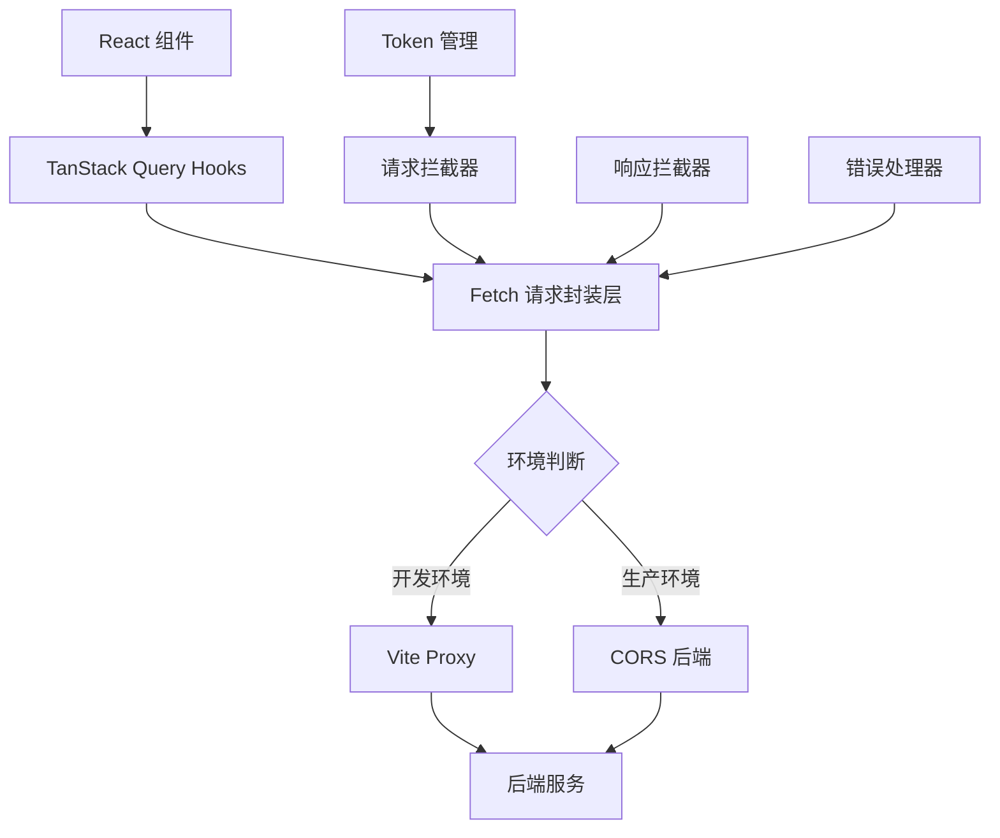
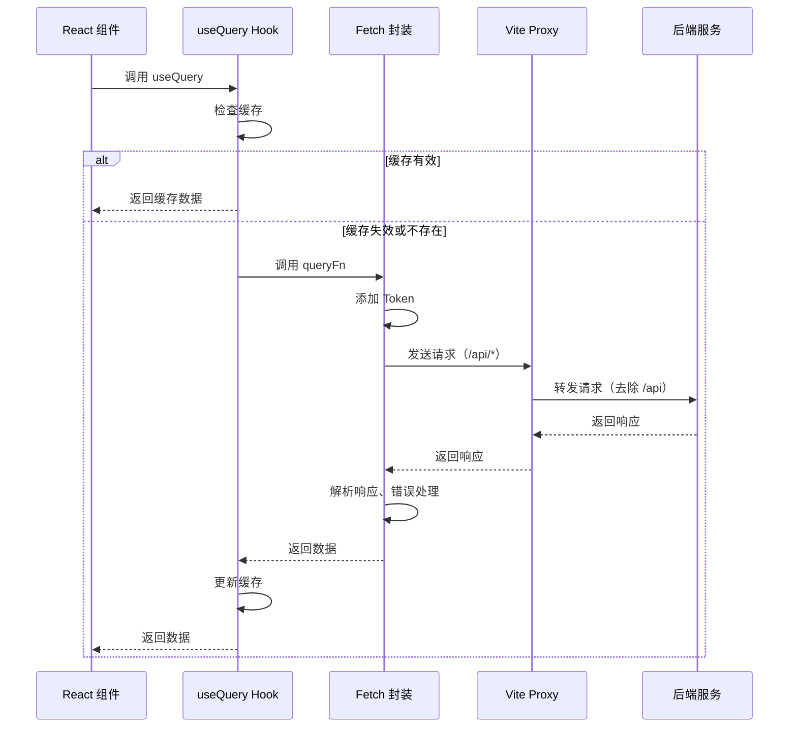
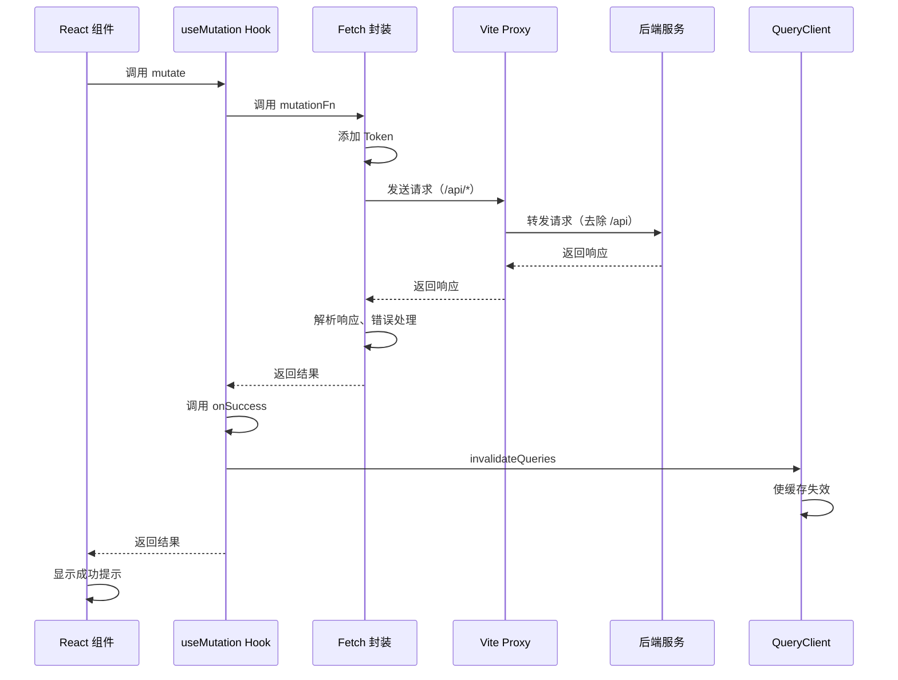

# 使用 TanStack Query + Fetch 替换 Axios 的技术方案

## 一、需求背景

当前项目使用 Axios 作为 HTTP 请求库，存在以下改进空间：

- 缺乏请求状态管理（loading、error 等）
- 缺少数据缓存和自动重新请求机制
- 需要手动处理跨域配置

本方案旨在引入 TanStack Query（React Query）结合原生 Fetch API，提升数据请求的开发体验和性能表现，同时完善跨域处理方案。

## 二、技术选型说明

### 2.1 为什么选择 TanStack Query

TanStack Query 是一个强大的异步状态管理库，提供：

- 自动缓存管理：减少重复请求
- 智能重新请求：网络恢复、窗口聚焦时自动刷新
- 请求状态管理：isLoading、isError、isFetching 等
- 乐观更新：提升用户体验
- 请求去重：相同请求自动合并
- 分页和无限滚动支持

### 2.2 为什么选择原生 Fetch

- 浏览器原生支持，无需额外依赖
- 体积更小，减少打包体积
- 标准化的 Promise API
- 足够满足项目需求

## 三、跨域解决方案

### 3.1 开发环境跨域处理

保留并优化现有 Vite 代理配置：

| 配置项       | 值                         | 说明                                  |
| ------------ | -------------------------- | ------------------------------------- |
| 代理路径     | /api                       | 拦截所有以 /api 开头的请求            |
| 目标地址     | http://192.168.60.249:8080 | 后端服务地址                          |
| 路径重写     | 去除 /api 前缀             | 将 /api/user/login 转发为 /user/login |
| changeOrigin | true                       | 修改请求头中的 origin                 |

**工作原理**：

1. 前端请求 http://localhost:5173/api/user/login
2. Vite 代理拦截请求
3. 将请求转发至 http://192.168.60.249:8080/user/login
4. 响应返回给前端

### 3.2 生产环境跨域处理

需要后端配置 CORS 响应头：

| 响应头                           | 值                              | 作用             |
| -------------------------------- | ------------------------------- | ---------------- |
| Access-Control-Allow-Origin      | 前端域名或 \*                   | 允许的来源       |
| Access-Control-Allow-Methods     | GET, POST, PUT, DELETE, OPTIONS | 允许的 HTTP 方法 |
| Access-Control-Allow-Headers     | Content-Type, Authorization     | 允许的请求头     |
| Access-Control-Allow-Credentials | true                            | 允许携带凭证     |
| Access-Control-Max-Age           | 3600                            | 预检请求缓存时间 |

**注意事项**：

- 若后端已配置 CORS，前端无需额外处理
- 生产环境需确保 Access-Control-Allow-Origin 配置正确的前端域名
- 若使用 Nginx 反向代理，也可在 Nginx 层统一处理跨域

## 四、架构设计

### 4.1 整体架构

### 4.2 核心模块划分

| 模块名称     | 职责                                         | 文件位置                 |
| ------------ | -------------------------------------------- | ------------------------ |
| Fetch 封装层 | 提供统一的 fetch 方法，处理请求/响应拦截     | src/utils/fetch.js       |
| API 层       | 定义业务接口，返回符合 TanStack Query 的函数 | src/api/\*.js            |
| Query 配置层 | 配置 QueryClient 全局参数                    | src/query/queryClient.js |
| Hooks 层     | 业务自定义 hooks，封装常用查询逻辑           | src/hooks/useQueries.js  |

## 五、Fetch 封装设计

### 5.1 基础 Fetch 封装

需要实现一个 `fetchWrapper` 函数，提供以下能力：

**请求拦截**：

- 自动添加 Content-Type 请求头
- 从 zustand store 获取 token 并添加到 Authorization 头
- 支持 GET 请求的查询参数序列化
- 支持自定义超时时间

**响应拦截**：

- 统一解析响应体为 JSON
- 处理业务状态码（code: 200/201 视为成功）
- 错误响应抛出异常供 TanStack Query 捕获

**错误处理**：

- HTTP 状态码错误处理（401、403、404、500 等）
- 网络错误处理
- 超时错误处理
- 401 错误自动清除登录态并跳转登录页

### 5.2 请求配置参数

| 参数名      | 类型   | 默认值                                 | 说明                                     |
| ----------- | ------ | -------------------------------------- | ---------------------------------------- |
| baseURL     | string | 空字符串                               | API 基础路径（开发环境为空，让代理处理） |
| timeout     | number | 10000                                  | 请求超时时间（毫秒）                     |
| headers     | object | { 'Content-Type': 'application/json' } | 默认请求头                               |
| credentials | string | 'include'                              | 携带 Cookie                              |

### 5.3 请求方法设计

封装以下 HTTP 方法：

| 方法   | 描述        | 参数                |
| ------ | ----------- | ------------------- |
| get    | GET 请求    | url, params, config |
| post   | POST 请求   | url, data, config   |
| put    | PUT 请求    | url, data, config   |
| delete | DELETE 请求 | url, config         |

## 六、TanStack Query 集成方案

### 6.1 QueryClient 配置

需要在应用根组件配置 QueryClientProvider，并设置全局默认参数：

**全局默认配置**：

| 配置项               | 值     | 说明                               |
| -------------------- | ------ | ---------------------------------- |
| refetchOnWindowFocus | false  | 窗口聚焦时不自动重新请求           |
| refetchOnReconnect   | true   | 网络重连时重新请求                 |
| retry                | 1      | 失败重试次数                       |
| staleTime            | 5000   | 数据新鲜度时间（5 秒内不重新请求） |
| cacheTime            | 300000 | 缓存时间（5 分钟）                 |

### 6.2 查询类 API 改造

针对 GET 请求类 API，使用 `useQuery` hook：

**使用模式**：

- queryKey：定义唯一标识，包含接口路径和查询参数
- queryFn：执行 fetch 请求的函数
- 返回值：包含 data、isLoading、isError、error、refetch 等

**示例场景**：

- 获取底盘列表：queryKey 包含页码、页大小、搜索条件
- 获取订单详情：queryKey 包含 VIN 码
- 获取参数列表：queryKey 包含筛选条件

### 6.3 变更类 API 改造

针对 POST/PUT/DELETE 请求，使用 `useMutation` hook：

**使用模式**：

- mutationFn：执行变更操作的函数
- onSuccess：成功回调，用于显示成功消息、刷新列表
- onError：失败回调，用于显示错误信息
- 返回值：包含 mutate、mutateAsync、isLoading、isError 等

**示例场景**：

- 用户登录：成功后保存 token、跳转首页
- 新增底盘：成功后刷新列表、关闭弹窗
- 删除订单：成功后使对应的查询缓存失效

### 6.4 缓存失效策略

当执行变更操作后，需要刷新相关数据缓存：

| 操作类型 | 缓存失效方式                     | 说明                             |
| -------- | -------------------------------- | -------------------------------- |
| 新增     | invalidateQueries                | 使列表查询缓存失效，触发重新请求 |
| 更新     | invalidateQueries + setQueryData | 使详情和列表缓存失效             |
| 删除     | invalidateQueries                | 使列表缓存失效                   |

## 七、API 层改造方案

### 7.1 改造原则

- 保持 API 函数的导出名称和参数不变
- 函数内部由 axios 调用改为 fetch 调用
- 请求路径保持不变（包含 /api 前缀）
- 返回值仍为 Promise

### 7.2 各模块 API 改造清单

| API 模块 | 文件路径             | 改造内容                                                                    |
| -------- | -------------------- | --------------------------------------------------------------------------- |
| 认证 API | src/api/auth.js      | login、logout、getCurrentUser、changePassword                               |
| 底盘 API | src/api/chassis.js   | getChassisList、getChassisById、createChassis、updateChassis、deleteChassis |
| 订单 API | src/api/order.js     | getOrderList、getOrderByVin、createOrder、updateOrder、deleteOrder          |
| 参数 API | src/api/parameter.js | 所有参数相关接口                                                            |
| 打印 API | src/api/print.js     | 所有打印相关接口                                                            |
| 报表 API | src/api/reports.js   | 所有报表相关接口                                                            |

### 7.3 组件层使用示例

**查询类场景**（列表页面）：

- 使用 useQuery 替代 useEffect + useState
- queryKey 包含分页和搜索参数
- 利用 isLoading 控制加载状态
- 利用 refetch 实现刷新功能

**变更类场景**（表单提交）：

- 使用 useMutation 执行新增/编辑/删除
- 在 onSuccess 中调用 queryClient.invalidateQueries 刷新列表
- 利用 isLoading 控制按钮禁用状态

## 八、数据流设计

### 8.1 查询数据流

### 8.2 变更数据流

## 九、错误处理策略

### 9.1 错误类型分类

| 错误类型  | 识别方式                       | 处理策略                       |
| --------- | ------------------------------ | ------------------------------ |
| 网络错误  | fetch 抛出异常                 | 显示"网络错误，请检查网络连接" |
| 超时错误  | AbortController 超时           | 显示"请求超时，请重试"         |
| HTTP 错误 | response.ok === false          | 根据状态码显示不同提示         |
| 业务错误  | response.data.code !== 200/201 | 显示后端返回的 message         |

### 9.2 HTTP 状态码处理

| 状态码 | 错误提示                            | 附加操作               |
| ------ | ----------------------------------- | ---------------------- |
| 401    | 未授权，请重新登录                  | 清除 token、跳转登录页 |
| 403    | 没有权限访问该资源                  | 无                     |
| 404    | 请求的资源不存在                    | 无                     |
| 500    | 服务器错误，请稍后重试              | 无                     |
| 其他   | 使用后端返回的 message 或"请求失败" | 无                     |

### 9.3 错误提示方式

所有错误提示通过 antd 的 message 组件展示，保持与现有项目一致的用户体验。

## 十、依赖变更清单

### 10.1 需要新增的依赖

| 依赖包                         | 版本   | 用途                 |
| ------------------------------ | ------ | -------------------- |
| @tanstack/react-query          | ^5.0.0 | React Query 核心库   |
| @tanstack/react-query-devtools | ^5.0.0 | 开发调试工具（可选） |

### 10.2 可移除的依赖

| 依赖包 | 说明                      |
| ------ | ------------------------- |
| axios  | 完全替换为 fetch 后可移除 |

**建议**：在完成迁移并充分测试后再移除 axios，避免影响现有功能。

## 十一、实施步骤建议

### 11.1 准备阶段

1. 安装 TanStack Query 依赖
2. 创建 Fetch 封装层
3. 配置 QueryClient 并集成到应用根组件
4. 验证开发环境 Vite 代理配置正常

### 11.2 API 改造阶段

1. 优先改造认证相关 API（login、logout）
2. 改造查询类 API（列表、详情）
3. 改造变更类 API（新增、编辑、删除）
4. 保持向后兼容，确保旧接口仍可用

### 11.3 组件改造阶段

1. 改造登录页面，使用 useMutation
2. 改造列表页面，使用 useQuery
3. 改造表单页面，使用 useMutation + invalidateQueries
4. 逐个模块验证功能正常

### 11.4 验证阶段

1. 功能验证：所有业务功能正常运行
2. 性能验证：缓存机制生效，减少重复请求
3. 错误验证：各类错误场景提示正确
4. 跨域验证：开发环境代理正常，生产环境 CORS 配置正确

### 11.5 清理阶段

1. 删除旧的 request.js 文件
2. 移除 axios 依赖
3. 更新项目文档

## 十二、注意事项

### 12.1 Token 管理

- Token 仍从 zustand 的 userStore 获取
- 401 错误时自动调用 userStore.logout() 清除登录态
- 保持现有的 Token 存储和管理逻辑不变

### 12.2 兼容性考虑

- 原生 Fetch API 在现代浏览器中支持良好
- 若需支持旧版浏览器，可引入 whatwg-fetch polyfill
- 本项目基于 Vite + React 19，无需考虑旧浏览器兼容

### 12.3 TypeScript 支持

虽然当前项目使用 JavaScript，但设计时考虑了类型定义的扩展性，便于未来升级为 TypeScript。

### 12.4 开发调试

建议安装 @tanstack/react-query-devtools，在开发环境可视化查看：

- 所有查询的缓存状态
- 请求的执行时间
- 缓存的数据内容
- 便于排查问题

## 十三、技术风险评估

| 风险项                     | 风险等级 | 应对措施                                |
| -------------------------- | -------- | --------------------------------------- |
| API 改造引入缺陷           | 中       | 逐个模块改造并充分测试                  |
| 生产环境跨域配置不当       | 中       | 提前与后端确认 CORS 配置                |
| 学习曲线导致进度延迟       | 低       | TanStack Query API 简洁，易于上手       |
| 缓存策略不当影响数据实时性 | 低       | 合理配置 staleTime 和 invalidateQueries |

## 十四、预期收益

### 14.1 开发体验提升

- 减少样板代码：无需手动管理 loading、error 状态
- 自动请求去重：避免短时间内重复请求
- 声明式数据流：代码逻辑更清晰

### 14.2 性能优化

- 智能缓存：减少不必要的网络请求
- 后台更新：用户无感知数据刷新
- 请求合并：相同请求自动去重

### 14.3 用户体验改善

- 更快的页面响应：利用缓存优先展示数据
- 乐观更新：变更操作即时反馈
- 网络恢复自动刷新：保证数据最新

### 14.4 代码质量提升

- 统一的错误处理机制
- 标准化的 API 调用方式
- 更好的可维护性和可测试性
